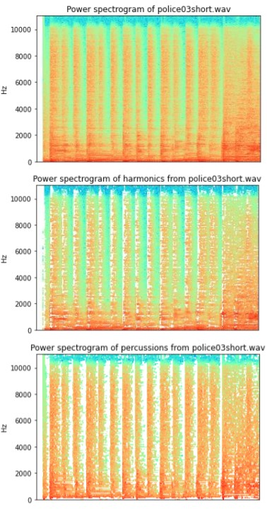
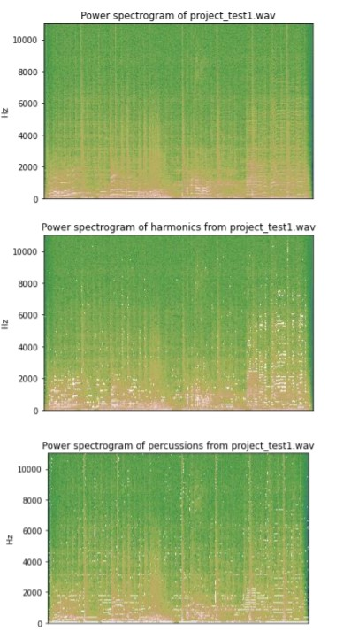

#  SEPARATION OF DRUMS FROM MUSIC SIGNALS
## Overview
The separation of drums (percussive components) from music signals is the challenge to be solved. To
tackle this problem, we find anisotropy in the percussive and harmonic components. On the
spectrogram, the harmonic component has a steady pitch and creates parallel ridges with smooth
temporal envelopes, but the energy of a percussive tone is concentrated in a short time frame, forming
a vertical ridge with a broad spectral envelope [1]. The spectrogram below explains this anisotropy. The
horizontal lines represent the harmonic components, while the vertical lines represent the percussive
components.
In other words, harmonic components have temporal continuity along time (thus the horizontal line on
the spectrogram), whereas percussive components have temporal continuity along frequency. In order
to make use of this discovery, we try to find spectrograms that maximize anisotropy. To maximum
efficiency, this can be done iteratively. The algorithm is based on the referenced research article.

## Algorithm implementation

The algorithm is based on the referenced research article [1].
The functions implemented in code are explained below.

HnP_Cal(hh,ii,W,H,P):
This function calculates H and P iteratively for the number of epochs specified and then the final H and P are normalised after the last iteration is completed. The H and P values are updated based on the calculated delta.
hh and ii are the max values of frequency and time bins.
W is the normalised STFT of the input signal and H and P are the harmonic and percussion components.
This function returns H and P.
This is the main function of our algorithm.

spectograms_plots(file):
This function plots the spectrograms of the original audio and the harmonic and percussion components.

ISTFT_cal():
This function calculates the inverse STFT of the obtained harmonic and percussion components:

evaluation_params(e,SNRh,SNRp,SNR):
This function calculates the evaluation parameters like SNR for the reconstructed signal, harmonic and percussion components also the accuracy of reconstructed signal.

The algorithm is run iteratively for different values of α and γ

## Evaluation

On two audio samples provided by the course: police03short.wav and project test1.wav, three different
assessment metrics were used: signal-to-noise ratio, spectrogram, and auditory evaluation.
We have calculated accuracy by taking the ratio of the sum of error array and the original audio signal
array.
Following are the results when α= 0.3 and γ =0.3

## Spectrogram

  

  

## Signal-to-noise ratio
The signal-to-noise ratio is defined as

                                〖SNR〗=10log_10 ((∑_t〖s(t)〗^2 )/(∑_t〖e(t)〗^2 )

where s(t) represents the original signal and e(t) represents the original signal less the separated signal A ratio larger than one (greater than 0 dB) shows that there is more signal than noise. To investigate the impact of the range compression coefficient and the number of search iterations on the quality, signal-to-noise ratios were determined. The observations on police03short.wav are depicted in the two charts below.

From these plots we can see that setting the range compression value to 1 (the highest possible value) will yield the highest SNR, minimizing the effect of noise. Changing the number of iterations, however, does not significantly affect the SNR. Similar observations are also observed in project_test1.wav. Therefore, we recommend setting γ to 1 and the number of iterations to at least 20 but increasing it won’t yield noticeable improvement.

## References

[1] Nobutaka Dno, Kenichi Miyamoto, Jonathan Le Roux, Hirokazu Kameoka, and Shigeki Sagayama “Separation of a monaural audio signal into harmonic/percussive components by complementary diffusion on spectrogram”. Proc. EUSIPCO, Aug 2008.

[2] Wikipedia: Signal-to-noise ratio. Available at: https://en.wikipedia.org/wiki/Signal-to-noise_ratio
